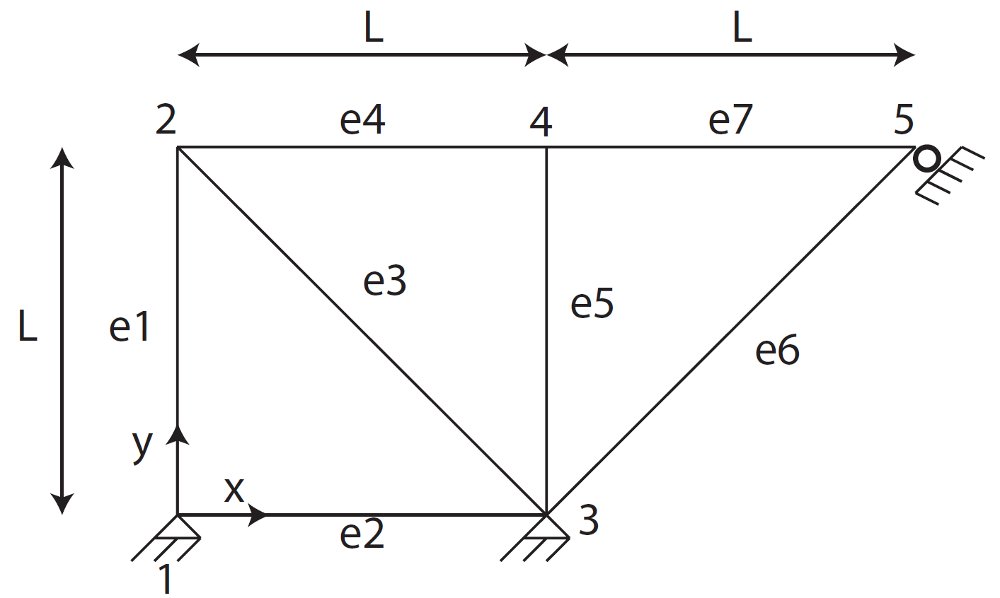

# 6 Elements Truss Analysis using FEM
The following repository contains MATLAB scripts that returns the vector of the displacement fields at each node as well as the reactions on the nodes of a 6 Elements Truss as illustrated in the Figure below, using Finite Element Method (FEM). The initial and final position of all the nodes is also illustrated.

# Truss_Disp_React_Calculator.m
This MATLAB script takes as inputs from the user:
- The cross-sectional area of the bars A (all bars have the same cross-sectional area),
- The modulus of elasticity of the bars E,
- The length L of the bars,
- The loads Px and Py placed at node 2 of the truss (Px and Py positive when having the same orientations as the axis x and y).

And as an output, the script returns a vector of the displacement fields at each node as well as the reactions on the nodes, with a visualisation of the initial and final displacement of each node.

# Required_Area_Calculator.m
This MATLAB script, uses the following parameters:
- The modulus of elasticity of the bars, E = 200 GPa, 
- The length of the bars, L = 1 m,
- The loads placed at node 2 of the truss are, Px = 10 kN & Py = -20 kN.

The output will be the required area A of the bars so that no displacement in the truss exceeds 5 mm.
